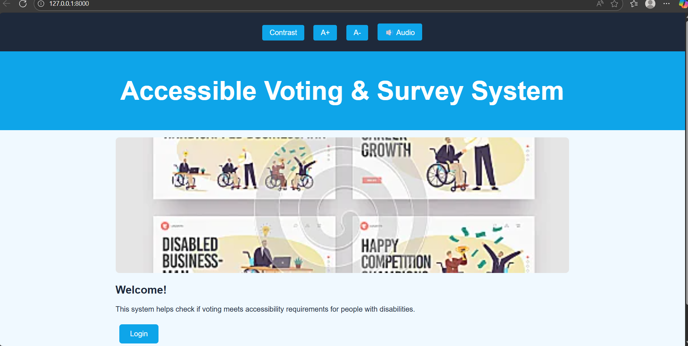
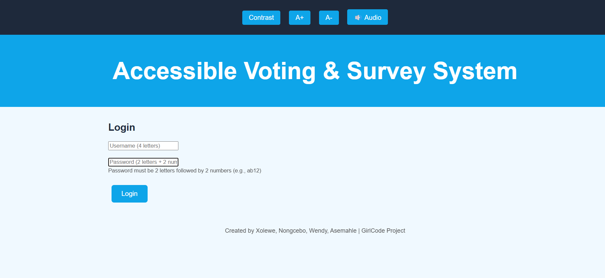
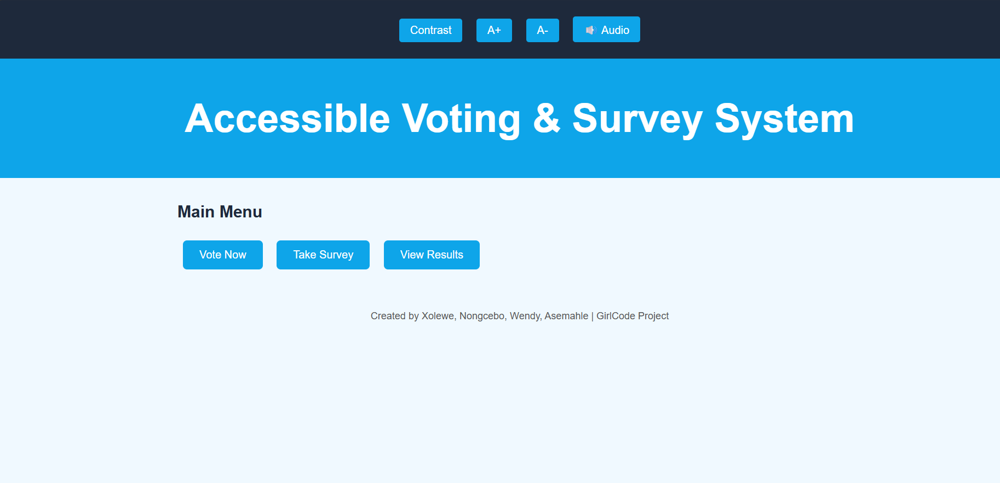
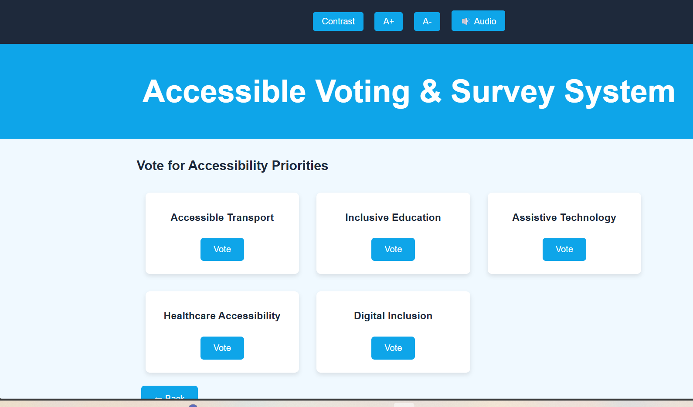
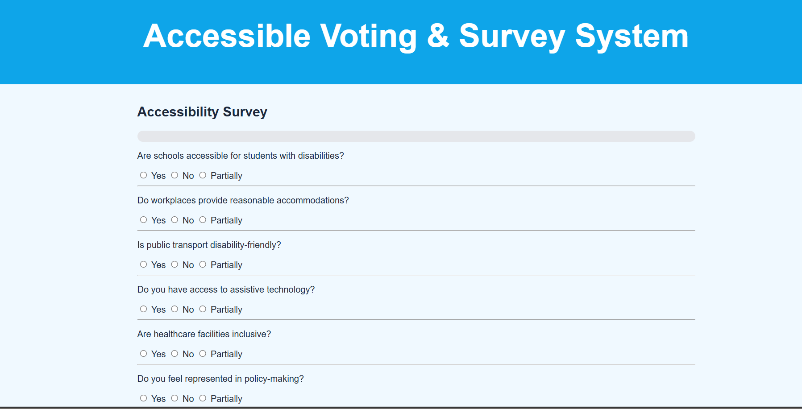
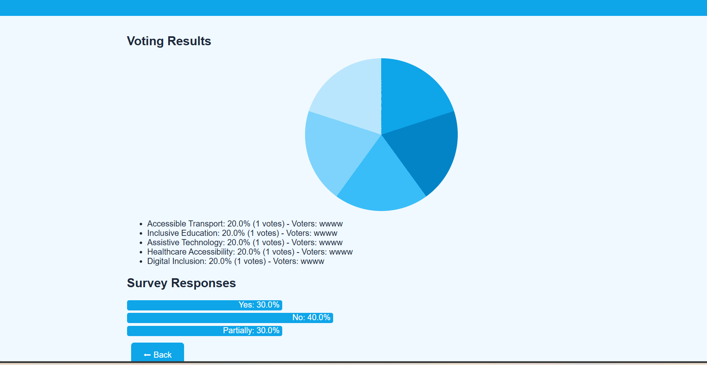

<div align="center">

# ♿ Accessible Voting & Survey System


---

### 🌍 Empowering Accessibility Through Technology

*A comprehensive voting and survey platform designed to ensure equal participation for people with disabilities*



[View Demo](#-screenshots) • [Features](#-key-features) • [Installation](#-installation) • [Team](#-meet-the-team)

---

</div>

## 📖 About The Project

The **Accessible Voting & Survey System** is a Django-powered web application created to evaluate and improve accessibility standards for people with disabilities. This platform enables users to:

- ✅ Vote on critical accessibility priorities
- ✅ Participate in comprehensive accessibility surveys
- ✅ View real-time results with interactive visualizations
- ✅ Experience full accessibility features including audio support, high contrast mode, and adjustable fonts

> 💡 *"Technology should be accessible to everyone, regardless of ability."*

---

## ✨ Key Features

<table>
<tr>
<td width="50%">

### 🗳️ Smart Voting System
Vote on important accessibility categories:
- 🚌 Accessible Transport
- 📚 Inclusive Education
- 💻 Assistive Technology
- 🏥 Healthcare Accessibility
- 🌐 Digital Inclusion

</td>
<td width="50%">

### 📋 Comprehensive Survey
10 carefully crafted questions covering:
- School accessibility
- Workplace accommodations
- Public transport
- Emergency services
- Policy representation

</td>
</tr>
<tr>
<td width="50%">

### 📊 Visual Analytics
- Real-time vote counting
- Pie chart visualizations
- Bar chart for survey responses
- Voter tracking per category

</td>
<td width="50%">

### ♿ Accessibility Tools
- 🔲 High Contrast Mode
- 🔤 Font Size Controls (A+ / A-)
- 🔊 Text-to-Speech Audio
- ⌨️ Keyboard Navigation

</td>
</tr>
</table>

---

## 📸 Screenshots

<div align="center">

### 🏠 Welcome Page
*The landing page introduces users to the system with a clean, accessible interface*


---

### 🔐 Login Page
*Secure login with validation (4-letter username + 2 letters & 2 numbers password)*



---

### 📋 Main Menu
*Easy navigation to all features: Vote, Survey, and Results*



---

### 🗳️ Voting Page
*Interactive cards for each accessibility priority with hover effects*



---

### 📝 Survey Page
*10-question survey with progress bar and audio support*



---

### 📊 Results Dashboard
*Visual representation of votes and survey responses*



</div>

---

## 🛠️ Installation

### Prerequisites

- Python 3.8 or higher
- Django 4.0+

### Step-by-Step Setup
```bash
# 1️⃣ Clone the repository
git clone https://github.com/GibbyEns/django-voting-system.git

# 2️⃣ Navigate to the project directory
cd django-voting-system

# 3️⃣ Install Django
pip install django

# 4️⃣ Run the development server
python voting_app.py runserver

# 5️⃣ Open your browser
# Visit: http://127.0.0.1:8000
```

---

## 🚀 How To Use

### Step 1: Login
| Field | Format | Example |
|-------|--------|---------|
| Username | 4 letters | `user` |
| Password | 2 letters + 2 numbers | `ab12` |

### Step 2: Navigate
- Click **"Vote Now"** to cast your vote
- Click **"Take Survey"** to complete the accessibility survey
- Click **"View Results"** to see voting and survey analytics

### Step 3: Accessibility Options
Use the toolbar at the top of every page:
| Button | Function |
|--------|----------|
| 🔲 Contrast | Toggle high contrast mode |
| A+ | Increase font size |
| A- | Decrease font size |
| 🔊 Audio | Enable text-to-speech |

---

## 🎯 Survey Questions

Our comprehensive survey covers 10 essential accessibility topics:

| # | Question |
|---|----------|
| 1 | Are schools accessible for students with disabilities? |
| 2 | Do workplaces provide reasonable accommodations? |
| 3 | Is public transport disability-friendly? |
| 4 | Do you have access to assistive technology? |
| 5 | Are healthcare facilities inclusive? |
| 6 | Do you feel represented in policy-making? |
| 7 | Are emergency services accessible? |
| 8 | Do you have access to digital accessibility tools? |
| 9 | Is voting easy for people with disabilities? |
| 10 | Would you recommend improvements in accessibility laws? |

**Response Options:** ✅ Yes | ❌ No | ⚠️ Partially

---

## 🏗️ Project Structure
```
django-voting-system/
│
├── voting_app.py          # Main application file
├── db.sqlite3             # Database
├── manage.py              # Django management
│
├── polls/                 # Polls app
├── voting_system/         # Voting system app
│
├── README.md              # Documentation
├── Welcome_Page.png       # Screenshot
├── login.png              # Screenshot
├── main.png               # Screenshot
├── voting.png             # Screenshot
├── Survey.png             # Screenshot
└── Results.png            # Screenshot
```

---

## 💻 Technology Stack

<div align="center">

| Technology | Purpose |
|------------|---------|
|  | Backend Logic |
|  | Web Framework |
|  | Structure |
|  | Styling |
|  | Interactivity |

</div>

---

## 👩‍💻 Meet The Team

<div align="center">

### 🎀 GirlCode Project Team 🎀

| Developer 
|-----------
| 👩‍💻 **Xolewe** 
| 👩‍💻 **Nongcebo** 
| 👩‍💻 **Wendy** 
| 👩‍💻 **Asemahle** 

---

*Created with ❤️ for the GirlCode *

</div>

---

## 🌟 Future Enhancements

- [ ] User registration system
- [ ] Database persistence
- [ ] Admin dashboard
- [ ] Export results to PDF
- [ ] Multi-language support
- [ ] Mobile responsive design improvements

---

## 🤝 Contributing

Contributions make the open-source community amazing! Any contributions are **greatly appreciated**.

1. Fork the Project
2. Create your Feature Branch (`git checkout -b feature/AmazingFeature`)
3. Commit your Changes (`git commit -m 'Add some AmazingFeature'`)
4. Push to the Branch (`git push origin feature/AmazingFeature`)
5. Open a Pull Request

---

## 📬 Contact

Have questions? Reach out to us!

- 📧 Email: [Asemahlezide22@gmail.com]
- 🔗 GitHub: [@GibbyEns](https://github.com/Asemahlezide22)

---

<div align="center">

### ⭐ If you found this project helpful, please give it a star! ⭐


</div>
